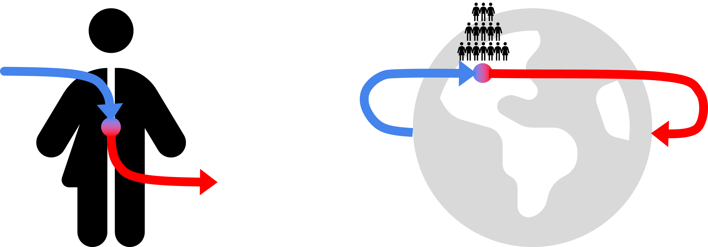
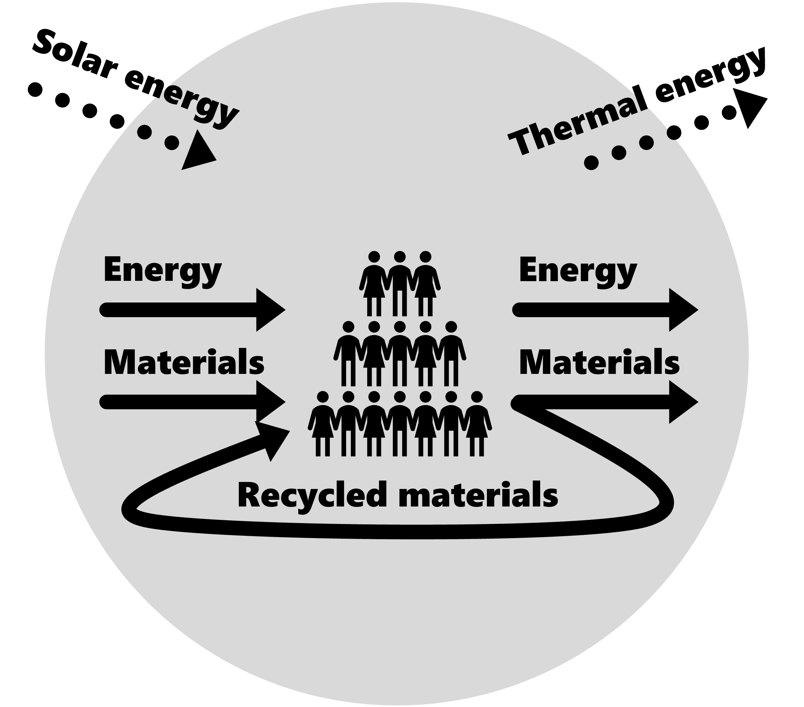

# Socio-economic metabolism

> *Last edit by*  *on 25/04/2024*[^1]. 
*Last review by* --- *on dd/mm/yyyy*.

### What is it?
Socio-economic metabolism is a fancy way of describing how society uses resources and energy to function, grow, and change over time. It's like the body's metabolism, but for human societies instead of individual organisms. Just as our body takes in food, breaks it down for energy and materials, and produces waste, societies also transform natural resources into goods and services, and generate waste in the process.

<figure>
    
    <figcaption>The socio-economic metabolism is very similar to the human metabolism in that something enters the system, which is processed there, and then, in a degraded form, leaves it again. Source: own drawing.</figcaption>
</figure>

The concept of socio-economic metabolism was first introduced by scientists in the 1960s and 1970s who were worried about the impact of human activities on the environment. They realized that as societies grow and develop, they extract more resources from nature, and produce more waste, which can harm the environment. So, they came up with this idea to better understand the relationship between human activities and the natural world, and how to make our societies more sustainable.

Here's a more detailed comparison between socio-economic metabolism and human metabolism:

### Similarities between Socio-economic Metabolism and Human Metabolism:
- **Input and Output:** Just like our body needs food and oxygen to function, and produces waste like carbon dioxide and urine, socio-economic metabolism also has inputs and outputs. The inputs are natural resources like minerals, water, and fossil fuels, and the outputs are products and waste.
- **Transformation:** In our body, food is broken down and transformed into energy and building blocks for our cells. Similarly, in socio-economic metabolism, natural resources are transformed into goods and services that we use in our daily lives, such as buildings, cars, phones, and food. When some goods have long lifetimes we call them stocks; buildings and cars are stocks, food is not.
- **Energy:** Both systems require energy to function. In human metabolism, we get energy from the food we eat, while in socio-economic metabolism, energy comes from various sources like coal, oil, gas, wind, and solar power.

<figure>
    
    <figcaption>The socio-economic metabolism relies on energy and material inflows, throughflows, and outflows. Societies are responsible for how small or big, how simple or complex these flows are. Everyone in this system can make choices that affect these flows. Source: own drawing.</figcaption>
</figure>

### Differences between Socio-economic Metabolism and Human Metabolism:
- **Scale:** Human metabolism involves individual organisms, while socio-economic metabolism deals with entire societies or even the global economy. So, the amounts of resources used and waste produced in socio-economic metabolism are much, much larger.
- **Complexity:** Socio-economic metabolism is far more complex than individual human metabolism because it involves many different activities and processes, from farming and manufacturing to transportation and communication.
- **Waste Management:** In human metabolism, waste products are usually dealt with by the body's own systems, like the kidneys and liver. But in socio-economic metabolism, waste management is a big challenge. We have to find ways to deal with all the garbage, pollution, and greenhouse gas emissions generated by our societies.
- **Sustainability:** Human metabolism is naturally sustainable because our bodies are designed to maintain a balance with the environment. However, socio-economic metabolism isn't always sustainable. If we use resources too quickly or produce too much waste, we can damage the environment and deplete our resources, harming future generations.

<figure>
    
    <figcaption>The cumulative flow of materials through the global economy in the years 1900-2015. DE stands for domestic extraction and summarises all materials extracted by countries. NAS stands for net addition to stock which describes the surplus of everything with a long lifetime beyond what goes to waste. DPO stands for domestic processed output and describes all materials that go to waste or are emitted in all countries. Source: <a href="https://doi.org/10.1016/j.gloenvcha.2018.07.003">Krausmann et al., 2018</a>.</figcaption>
</figure>

In summary, socio-economic metabolism is like a bigger, more complex version of human metabolism for entire societies. Understanding it helps us figure out how to make our societies more environmentally friendly and ensure that we have enough resources for the future. Scientists and policymakers use this concept to guide decisions about resource use, waste management, and [sustainable development](./sustainable_development.md). And this is necessary, because our global socio-economic metabolism grows more and more, thus pushing us beyond [planetary boundaries](./planetary_boundaries.md).

<figure>
    
    <figcaption>Historical and projected global material extraction in Gt/yr by main material groups (left axis) and in t/cap/yr (right axis) for the years 1900-2050. DE stands for domestic extraction and summarises all materials extracted by countries. Source: <a href="https://doi.org/10.1016/j.gloenvcha.2018.07.003">Krausmann et al., 2018</a>.</figcaption>
</figure>

[^1]: The original text of this article was generated using [HuggingChat](https://huggingface.co/chat) with the model CohereForAI/c4ai-command-r-plus on 18 April 2024. The prompt given was: "Please explain what socio-economic metabolism is and the history of this concept. Compare the socio-economic metabolism with the human metabolism. For your answer, please draw from these two sources, among others: https://link.springer.com/chapter/10.1007/978-3-031-34378-0_5 and https://www.nature.com/articles/s41893-019-0225-2. Formulate your answer as if I were 15 years old and keep the word count down to a maximum of 700 words."